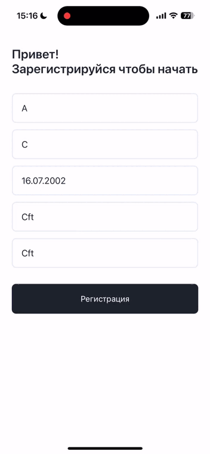
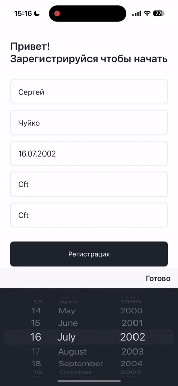
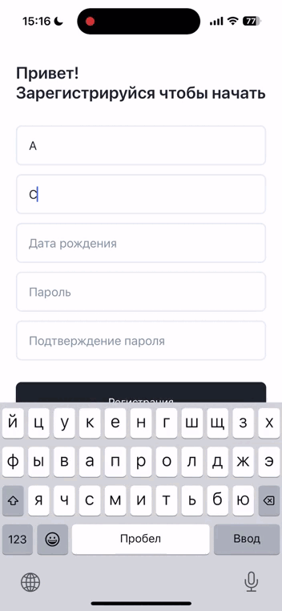
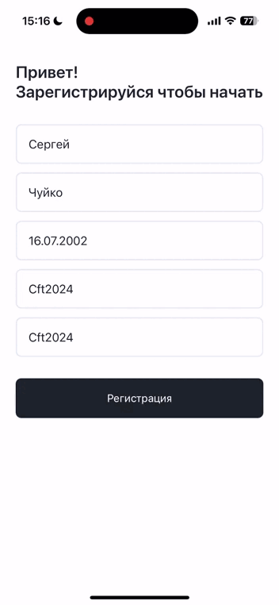
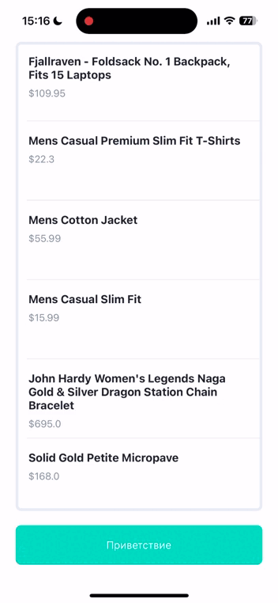
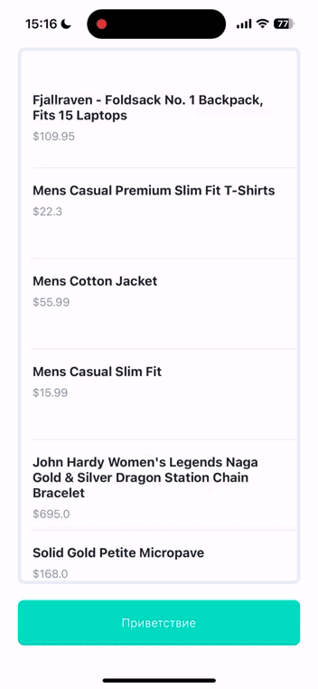
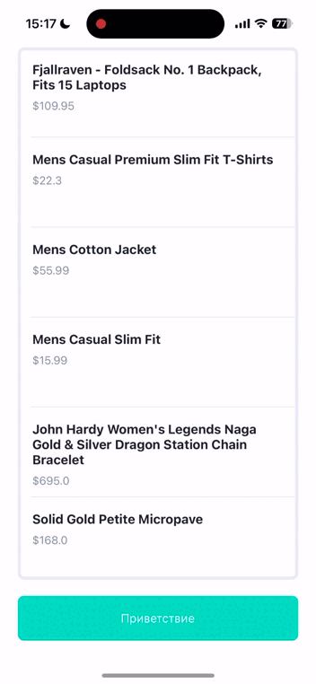
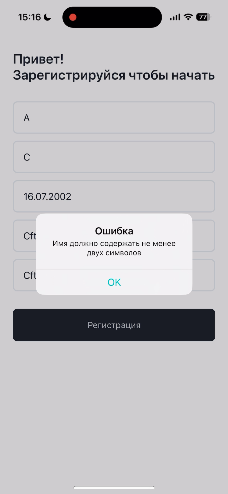
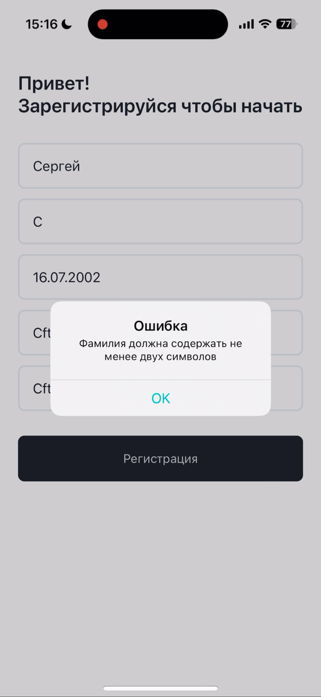
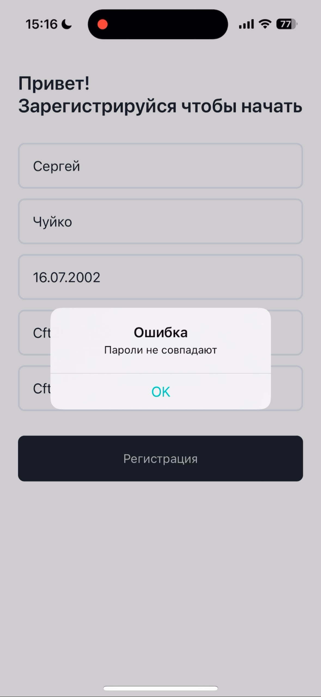

## Тестовое задание ШИФТ ЦФТ Лабаратория
Правила для корректных данных:
- Имя не может содержать менее двух символов
- Фамилия не может содержать менее двух символов
- Пароль должен содержать цифры и буквы верхнего регистра
- Пароли должны совпадать

## Я пактиковал
- Аритектурный паттерн MVVM
- Использование UserDefaults
- Работу с API
- Рисование форм

## Приложение в действии

### Анимация экрана регистрации
<table>
  <tr align="center">
    <td width="250">Уведомление об ошибки имени и фамилии</td>
    <td width="250">Уведомление об ошибке валидации паролей</td>
    <td width="250">Выбор даты при помощи DatePicker</td>
    <td width="250">Нажатие кнопки для перехода на следующий экран</td>
  </tr>
  <tr align= "center">
    <td width="250"></td>
    <td width="250"></td>
    <td width="250"></td>
    <td width="250"></td>
  </tr>
 </table>

### Анимация главного экрана
<table>
  <tr align="center">
    <td width="250">Прокрутка таблицы</td>
    <td width="250">Приветствие</td>
    <td width="250">Проверка сохранения сессии</td>

  </tr>
  <tr align= "center">
    <td width="250"></td>
    <td width="250"></td>
    <td width="250"></td>

  </tr>
 </table>

#
## Изображения ошибок верификации

  
  
  
  

